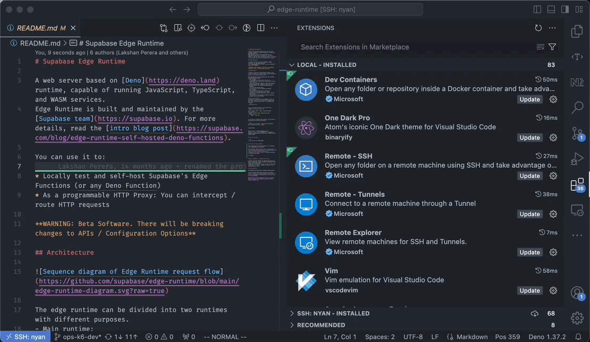

# Developing Supabase Edge Runtime

- [How to run locally](#how-to-run-locally)
- [How to run tests](#how-to-run-tests)
- [How to update to a newer Deno version](#how-to-update-to-a-newer-deno-version)
- [How to use Dev Container](#how-to-use-dev-container)
- [Running load tests inside a Dev Container](#running-load-tests-inside-a-dev-container)

## How to run locally
To serve all functions in the examples folder on port 9998, you can do this with the [example main service](./examples/main/index.ts) provided with this repo
```sh
./scripts/run.sh
```

Test by calling the [hello world function](./examples/hello-world/index.ts)
```sh
curl --request POST 'http://localhost:9998/hello-world' \
--header 'Content-Type: application/json' \
--data-raw '{
    "name": "John Doe"
}'
```

To run with a different entry point, you can pass a different main service like below

```sh
./scripts/run.sh start --main-service /path/to/main-service-directory -p 9000
```

using Docker:

```
docker build -t supabase/edge-runtime .
docker run -it --rm -p 9000:9000 -v ./examples/:/examples supabase/edge-runtime start --main-service /examples/main
```

Another option would be to install [Orb](https://docs.orbstack.dev/install) and use an [Orbstack Machine](https://docs.orbstack.dev/machines/) to run a Linux Machine.

First create a machine:

```
orb create ubuntu new-ubuntu
```

and run `orb` in the base directory to enter the virtual machine.

## How to run tests

```sh
./scripts/test.sh [TEST_NAME]
```

## How to update to a newer Deno version

* Select the Deno version to upgrade and visit its tag on GitHub (eg: https://github.com/denoland/deno/blob/v1.30.3/Cargo.toml)
* Open the `Cargo.toml` at the root of of this repo and modify all `deno_*` modules to match to the selected tag of Deno.

## How to use Dev Container

This repository uses Dev Container for a unifying local development environment.

* Dev Container requires [VS Code](https://code.visualstudio.com/download) and [Docker](https://www.docker.com/get-started/) to be pre-installed to use it.

* Install the [Dev Containers extension](https://marketplace.visualstudio.com/items?itemName=ms-vscode-remote.remote-containers) to VS Code.

* Open the command palette, and select `Dev Containers: Open Folder in Container...`

  

## Running load tests inside a Dev Container

> This section assumes that you have completed the Dev Container configuration on your local machine. If you don't have it configured, go back to [this section](#how-to-use-dev-container).

`Dockerfile` in the .devcontainer only pulls in the required packages, so you'll need to install additional packages for load testing.

edge-runtime repository already has a script located in `k6/scripts/setup.sh` that automates the process of installing these packages.

You can run this script from a shell to automatically get your setup ready for load testing.

```sh
vscode ➜ /workspaces/edge-runtime $ cd ./k6/scripts/
vscode ➜ /workspaces/edge-runtime/k6/scripts $ ls
setup.sh

# Note that the commands below are prefixed with `sudo`.
vscode ➜ /workspaces/edge-runtime/k6/scripts $ sudo ./setup.sh 
```

Once you run the script, you no longer need to run it again unless you delete the dev container or reinitialize the volume.

After running the script, `k6` should run normally as shown below.

```sh
vscode ➜ /workspaces/edge-runtime/k6/scripts $ k6 --help

          /\      |‾‾| /‾‾/   /‾‾/   
     /\  /  \     |  |/  /   /  /    
    /  \/    \    |     (   /   ‾‾\  
   /          \   |  |\  \ |  (‾)  | 
  / __________ \  |__| \__\ \_____/ .io

Usage:
  k6 [command]

Available Commands:
  archive     Create an archive
  cloud       Run a test on the cloud
  completion  Generate the autocompletion script for the specified shell
  help        Help about any command
...
```

Once you've confirmed that k6 is run properly, you can proceed to load testing.

* Run `./scripts/run.sh` in your shell to run edge-runtime.

  ```sh
  vscode ➜ /workspaces/edge-runtime $ pwd
  /workspaces/edge-runtime

  vscode ➜ /workspaces/edge-runtime $ cat ./scripts/run.sh 
  #!/usr/bin/env bash

  GIT_V_TAG=0.1.1 cargo build && EDGE_RUNTIME_PORT=9998 RUST_BACKTRACE=full ./target/debug/edge-runtime "$@" start --main-service ./examples/main --event-worker ./examples/event-manager

  vscode ➜ /workspaces/edge-runtime $ ./scripts/run.sh
    Compiling base v0.1.0 (/workspaces/edge-runtime/crates/base)
    Compiling cli v0.1.0 (/workspaces/edge-runtime/crates/cli)
    Finished dev [unoptimized + debuginfo] target(s) in 1m 59s
  warning: the following packages contain code that will be rejected by a future version of Rust: cexpr v0.3.6, nom v4.2.3
  note: to see what the problems were, use the option `--future-incompat-report`, or run `cargo report future-incompatibilities --id 1`
  event manager running
  main function started
  ```

* Run k6 in another shell with the scenario script path
  ```sh
  vscode ➜ /workspaces/edge-runtime $ k6 run ./k6/dist/specs/simple.js
  
          /\      |‾‾| /‾‾/   /‾‾/   
     /\  /  \     |  |/  /   /  /    
    /  \/    \    |     (   /   ‾‾\  
   /          \   |  |\  \ |  (‾)  | 
  / __________ \  |__| \__\ \_____/ .io

     execution: local
        script: ./k6/dist/specs/simple.js
        output: -

     scenarios: (100.00%) 1 scenario, 12 max VUs, 40s max duration (incl. graceful stop):
              * simple: 12 looping VUs for 10s (gracefulStop: 30s)

  running (09.9s), 12/12 VUs, 12514 complete and 0 interrupted iterations
  simple   [====================================>-] 12 VUs  09.9s/10s
  ```

  If you want to visualize the results in real-time, set the `K6_WEB_DASHBOARD=true` environment 
  variable as shown below.

  ```sh
  vscode ➜ /workspaces/edge-runtime $ K6_WEB_DASHBOARD=true k6 run ./k6/dist/specs/simple.js
  ```

  This will expose the endpoints that can view the visualized data.

  The load testing scripts are located in `k6/specs`. You can look at `k6/specs/simple.ts` to implement your own if you need additional load-testing scenarios.

  If load testing scripts have changed, you need to recompile them by performing the command below in your shell.

  ```sh
  vscode ➜ /workspaces/edge-runtime/k6 $ npm run build

  > edge-runtime-load-testing@1.0.0 build
  > vite build

  The CJS build of Vite's Node API is deprecated. See https://vitejs.dev/guide/troubleshooting.html#vite-cjs-node-api-deprecated for more details.
  vite v5.1.6 building for production...
  ✓ 2 modules transformed.
  Entry module "specs/simple.ts" is using named and default exports together. Consumers of your bundle will have to use `chunk.default` to access the default export, which may not be what you want. Use `output.exports: "named"` to disable this warning.
  dist/specs/simple.js  0.72 kB │ gzip: 0.46 kB
  ✓ built in 72ms
  ```

  For more about k6, see [this documentation](https://grafana.com/docs/k6/latest).
